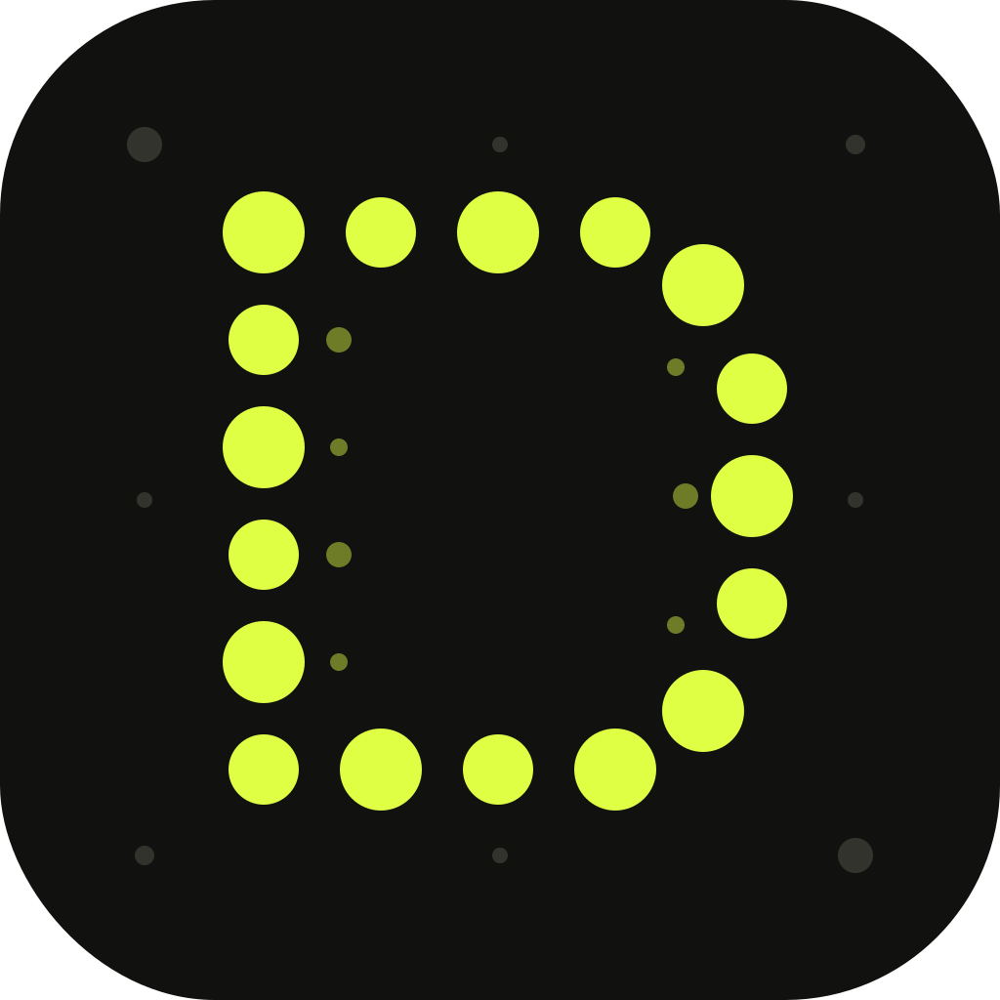

<p align="center">
  
</p>

<h1 align="center">Dither Lab</h1>

<p align="center">
  Turn any image into dithered pixel art, directly in your browser or on Android.
</p>

<p align="center">
  <a href="https://blademasterlol.github.io/dither-lab/"></a>
  <a href="https://github.com/BladeMasterLOL/dither-lab/releases/latest"></a>
</p>

<p align="center">
  <a href="https://github.com/BladeMasterLOL/dither-lab/actions/workflows/android-apk.yml"></a>
</p>

<p align="center"><a href="#english">English</a> · <a href="#español">Español</a></p>

---

## English

Dither Lab is a fast, privacy-friendly image dithering tool. Images never leave your device: all processing happens locally with Canvas, both on the web and inside the Android app.

### Features

- Floyd–Steinberg, Atkinson, Bayer 4×4, and Stucki algorithms
- Five color palettes and live tone controls
- Before/after comparison slider
- Full-resolution PNG export
- Native Android save and share support
- Persistent English and Spanish interface
- Responsive desktop and mobile design

### Use it

- **Web:** [blademasterlol.github.io/dither-lab](https://blademasterlol.github.io/dither-lab/)
- **Android:** [download the latest APK](https://github.com/BladeMasterLOL/dither-lab/releases/latest)

### Run locally

Open `index.html` in a browser or serve the repository with any static file server. No backend is required.

### Android development

The Android app is built with Capacitor. Every relevant push to `main` runs the **Build Android APK** workflow and publishes an installable debug APK as a GitHub Actions artifact.

```bash
pnpm install
pnpm run sync:android
cd android
./gradlew assembleDebug
```

---

## Español

Dither Lab es una herramienta rápida y privada para aplicar dithering a imágenes. Tus archivos nunca salen del dispositivo: todo se procesa localmente con Canvas, tanto en la web como dentro de la aplicación Android.

### Características

- Algoritmos Floyd–Steinberg, Atkinson, Bayer 4×4 y Stucki
- Cinco paletas de color y ajustes de tono en vivo
- Comparador interactivo antes/después
- Exportación PNG en alta resolución
- Guardado y compartir nativo en Android
- Interfaz persistente en español e inglés
- Diseño adaptable para escritorio y móvil

### Usar la aplicación

- **Web:** [blademasterlol.github.io/dither-lab](https://blademasterlol.github.io/dither-lab/)
- **Android:** [descargar la APK más reciente](https://github.com/BladeMasterLOL/dither-lab/releases/latest)

### Ejecutar localmente

Abre `index.html` en un navegador o sirve el repositorio con cualquier servidor de archivos estáticos. No necesita backend.

### Desarrollo Android

La aplicación Android utiliza Capacitor. Cada cambio relevante en `main` ejecuta el workflow **Build Android APK** y genera una APK instalable como artefacto de GitHub Actions.
